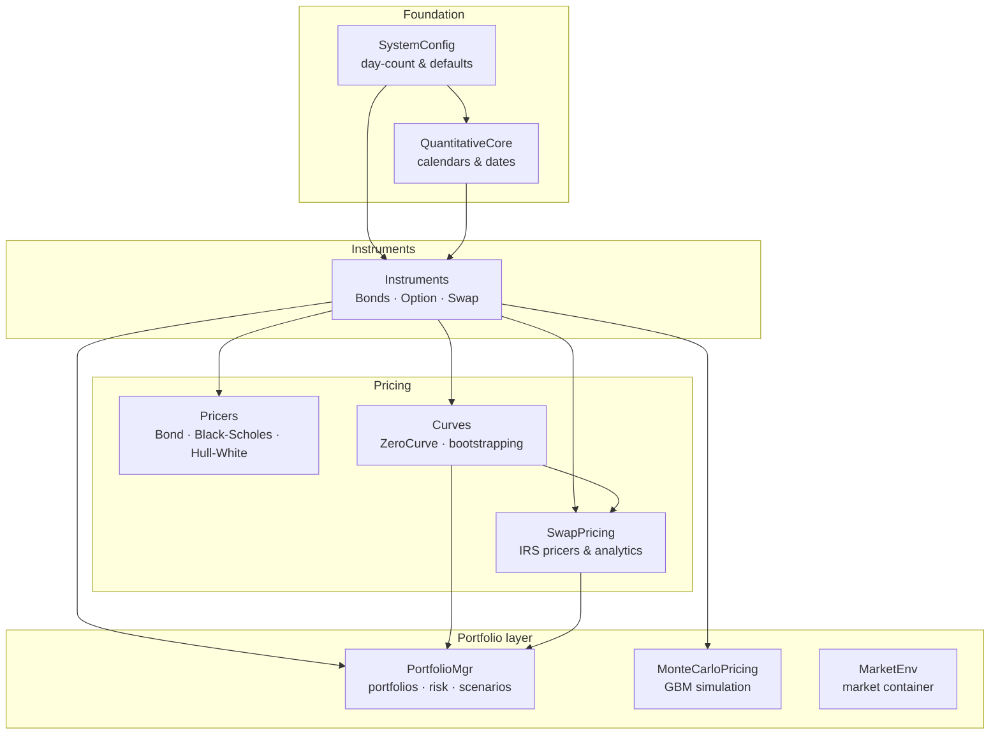

# QuantitativeLib

[](https://www.gnu.org/licenses/gpl-3.0)
[](https://julialang.org)
[](https://github.com/QuantitativeAI/QuantitativeLib/actions/workflows/CI.yml)

A Julia library for quantitative finance — fixed-income pricing, interest-rate curves, swap analytics, portfolio risk management, and Monte Carlo option pricing.

## Overview

QuantitativeLib provides a modular framework for modeling and pricing financial instruments. It covers the full lifecycle from instrument definition through curve bootstrapping to valuation, risk analytics, and scenario comparison — with a focus on clarity and extensibility.



## Features

| Module | What it does | Key API |
| --- | --- | --- |
| **Instruments** | Financial instrument types | `ZeroCouponBond`, `CouponBond`, `Option`, `Swap` |
| **Pricers** | Closed-form & model pricers | `BondPricer` (continuous & simple), `BlackScholesPricer`, `HullWhitePricer` |
| **Curves** | Term-structure modelling | `ZeroCurve` (log-linear), `YieldCurve`, `ForwardCurve`, …, `bootstrap_zero_curve` |
| **SwapPricing** | IRS valuation & analytics | `StandardSwapPricer`, `par_rate`, `modified_duration`, `settle_swap` |
| **PortfolioMgr** | Nestable portfolios, risk, scenarios | `Portfolio`, `market_value`, `duration`, `convexity`, `key_rate_durations`, `portfolio_yield`, `PortfolioScenario`, `compare_scenarios`, `save_scenario` |
| **MonteCarloPricing** | GBM path simulation | `colwise_simulate_stock_prices`, `priceCallOptionBroadcasted` |
| **MarketEnv** | Unified market-state container | `MarketEnvironment` (curves, vol surfaces, spot/FX, regimes) |
| **SystemConfig** | TOML-driven defaults | `day_count`, `default_digits`, … (built-in parser, no extra deps) |

## Installation

```julia
using Pkg
Pkg.add(path="/path/to/QuantitativeLib")   # local path
# or
Pkg.add("QuantitativeLib")                 # if registered
```

The only third-party dependency is `Interpolations`; everything else is the Julia standard library.

## Quick Start

### Bond pricing

```julia
using QuantitativeLib
using Dates

bond = ZeroCouponBond(Date(2024, 1, 1), Date(2026, 1, 1), 100.0)
p = BondPricer(bond, 0.05)   # 5% discount rate, continuous compounding
price = QuantitativeLib.price(p)
```

### Curve construction

```julia
issue = Date(2026, 1, 1)
curve = ZeroCurve(issue, [
    (Date(2027, 1, 1), 0.02),
    (Date(2028, 1, 1), 0.03),
])

df = discount_factor(curve, Date(2027, 7, 1))
fr = forward_rate(curve, Date(2027, 1, 1), Date(2028, 1, 1))
```

### Portfolio valuation & risk

```julia
using QuantitativeLib
using Dates

issue = Date(2026, 1, 1)
curve = ZeroCurve(issue, [
    (Date(2027, 1, 1), 0.02),
    (Date(2028, 1, 1), 0.03),
    (Date(2029, 1, 1), 0.035),
])

zcb = ZeroCouponBond(issue, Date(2028, 1, 1), 100.0)
cal = InstrumentCalendar([Date(2026, 7, 1), Date(2027, 1, 1)])
cb  = CouponBond(issue, cal, 0.04, 100.0)
generate_coupons!(cb)

p = Portfolio("CreditBook"; valuation_date=issue)
add_instrument!(p, zcb, 2.0, "ZCB_2y")
add_instrument!(p, cb,  1.0, "Coupon_3y")

market_value(p, curve)            # 290.31
duration(p, curve)                # 1.6454  (years)
convexity(p, curve)               # 2.6859
portfolio_yield(p, curve)         # 2.7896% (continuously compounded)
expected_return(p, curve, Date(2027, 1, 1))   # 2.0201% (curve-consistent)
```

Portfolios are nestable — a `Portfolio` is itself an `Instrument`, so sleeves and sub-books compose naturally.

### Scenario comparison

A `PortfolioScenario` pins a portfolio to a **valuation curve** (today's value) and an optional **projected curve** (the curve expected to hold at the horizon). The same book, different curve assumptions, saved and compared side by side:

```julia
horizon = Date(2027, 1, 1)

sc_flat     = PortfolioScenario("Flat",      p, curve;                       horizon=horizon)
sc_steep    = PortfolioScenario("Steepened", p, curve,
                                parallel_shifted_curve(curve, 0.01);         horizon=horizon)

println(scenario_table([sc_flat, sc_steep]))
```

```text
Metric              Flat          Steepened
--------------------------------------------------------------
value               290.3106      290.3106
yield               0.027896      0.027896
duration            1.64539       1.64539
convexity           2.68589       2.68589
projected_return    0.020201      0.030455
--------------------------------------------------------------
krd node 1          -188.74       -188.74
krd node 2          -79.66        -79.66
krd node 3          0.0           0.0
```

Scenarios persist with the stdlib — no extra packages:

```julia
save_scenario("scenarios/steepened.jls", sc_steep)
sc = load_scenario("scenarios/steepened.jls")

# or compare numerically: rows = (value, yield, duration, convexity, projected_return)
m = compare_scenarios([sc_flat, sc_steep])
```

### Monte Carlo option pricing

```julia
using QuantitativeLib.Instruments: Option

option = Option(100.0, 100.0, Date(2027, 1, 1), 0.2, 0.05, 0.0)

trading_days = Int(floor((option.expiry_date - Date(2026, 9, 4)).value * 252 / 365))
prices = colwise_simulate_stock_prices(option.underlying_price,
                                       option.risk_free_rate,
                                       option.volatility,
                                       trading_days, 10_000)

price = priceCallOptionBroadcasted(prices, option.risk_free_rate,
                                   trading_days / 252.0, option.strike_price)
```

## Project Structure

```
.
  test_run.jl                 # End-to-end smoke test (run from the REPL)
src/
  QuantitativeLib.jl          # Top-level module & exports
  SystemConfig.jl             # Config loader & accessors
  QuantitativeCore.jl         # Calendar & date utilities
  Instruments.jl              # Bond, Option, Swap types
  Pricers.jl                  # BondPricer, BlackScholesPricer, HullWhitePricer
  Curves.jl                   # ZeroCurve, interpolation, bootstrapping
  SwapPricing.jl              # IRS pricers & analytics
  Portfolio.jl                # Portfolios, risk metrics, scenarios
  MonteCarloPricing.jl        # GBM simulation & option pricing
  MarketEnv.jl                # MarketEnvironment container
config/
  quantitative_lib.toml       # Day-count & default configuration
test/
  runtests.jl                 # Full test suite
  portfolio_test.jl           # Portfolio & scenario tests
  montecarlo_test.jl          # Monte Carlo tests
demo/
  coupon_bond_demo.jl
  swap_pricing_demo.jl
  portfolio_demo.jl
  monte_carlo_pricing_demo.jl
  market_env_demo.jl
```

## Running Tests

```bash
julia --project -e 'using Pkg; Pkg.test()'
```

## Demos

```bash
julia --project demo/coupon_bond_demo.jl
julia --project demo/swap_pricing_demo.jl
julia --project demo/portfolio_demo.jl
julia --project demo/monte_carlo_pricing_demo.jl
julia --project demo/market_env_demo.jl
```

## Configuration

Edit `config/quantitative_lib.toml` to customize day-count conventions, default precision, and curve settings. The library ships with sensible defaults and a built-in TOML parser — no extra dependencies are required.

## License

GPL-3.0 — see [LICENSE](LICENSE) for details.
